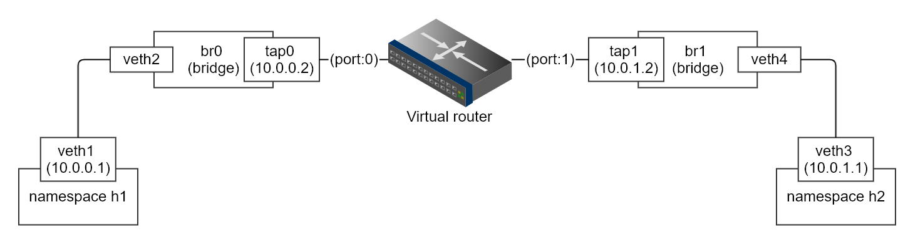

# Virtual router

Using tuntap to simulate router port, and C to implement software router and related network functions.

We demostrate this virtual router with 2 router ports for simplicity. All environment can be run on single computer with linux network virtualization support.
1. Using namespace to simulate host machine.
2. Using `tuntap` client to simulate router's port.
3. Using virtual link (`veth`) to connect namespace with our ports in `bridge`.

## How to use

* Build demo topology
    * `./.scripts/create_topo.sh`
* Build and run virtual router
    * `make`
    * `./router.exe -i tap0 tap1`
* Run the traffic
    * ping 
        * h1 to h2: `ip netns exec h1 ping 10.0.1.1`
        * h1 to port0: `ip netns exec h1 ping 10.0.0.2`
        * h2 to h1: `ip netns exec h2 ping 10.0.0.1`
        * h2 to port1: `ip netns exec h2 ping 10.0.1.2`

## Contact
* Kevin Cyu, kevinbird61@gmail.com